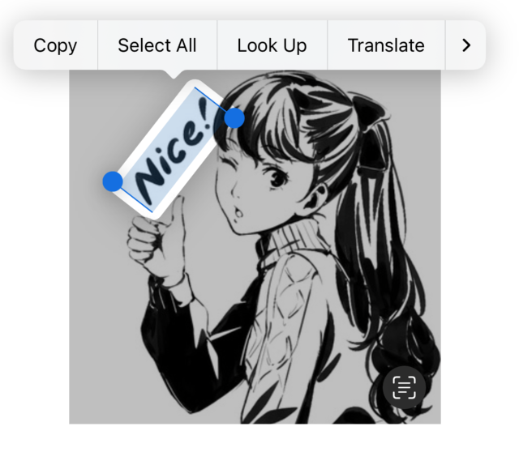

# react-native-live-text-view

Enabling Live Text interactions with image.

## Highlights

- 🔥 Built with Expo's Module API
- 🎉 Supports both Image and expo-image.
- 🍎 iOS only (iOS 16.0+)

## Preview



## Installation

### Expo development build

Install the library:

```shell
npx expo install react-native-live-text-view
```

Then rebuild your app:

```shell
npx expo prebuild -p ios --clean npx expo run:ios
```

### Bare React Native projects

You must ensure that you have
[installed and configured the `expo` package](https://docs.expo.dev/bare/installing-expo-modules/)
before continuing.

Install the library:

```shell
npm install react-native-live-text-view
```

Run `npx pod-install`

## Usage

### Basic

```tsx
import { LiveTextView } from 'react-native-live-text-view';

<LiveTextView>
  <Image source={{ uri: imageUri }} style={{ height, width }} />
</LiveTextView>;
```

### Example

```shell
git clone repo
cd example
npm run ios
```

## API

### Props

| Name                   | Type                                              | Required | Description                                                                                                        |
| ---------------------- | ------------------------------------------------- | -------- | ------------------------------------------------------------------------------------------------------------------ |
| children               | `ReactNode`                                       | Yes      | The image for live text interaction.                                                                               |
| style                  | `StyleProp<ViewStyle>`                            | No       | Container style                                                                                                    |
| disabled               | `boolean`                                         | No       | Whether to turn off the image analysis. Default value is `false`                                                   |
| liveActionButtonHidden | `boolean`                                         | No       | Whether to hide the live action button in the lower right corner. Default value is `false`                         |
| onStart                | `() => void`                                      | No       | Called when image analysis starts.                                                                                 |
| onReady                | `(event: OnReadyEventData) => void`               | No       | Called when image analysis success.                                                                                |
| onError                | `(event: OnErrorEventData) => void;`              | No       | Called when image analysis fail.                                                                                   |
| onHighlightChange      | `(isHighlight: boolean) => void`                  | No       | Called when recognized items in the image appear highlighted as a result of a person tapping the Live Text button. |
| onTextSelectionChange  | `(event: OnTextSelectionChangeEventData) => void` | No       | Called when the interaction’s text selection changes.                                                              |

### Types

```ts
interface OnReadyEventData {
  /*
   * Whether the analysis finds the specified types in the image.
   */
  hasResults: boolean;
  /*
   * The string that the text items in the image represent.
   */
  transcript: string;
}
```

```ts
interface OnErrorEventData {
  /*
   * error message
   */
  error: string;
}
```

```ts
interface OnTextSelectionChangeEventData {
  /*
   * Selected text, require iOS 17.0+
   */
  selectedText: string;
  /*
   * Whether has text been selected.
   */
  hasActiveTextSelection: boolean;
}
```

```ts
interface OnHighlightChangeEventData {
  /*
   * Whether recognized items in the image appear highlighted
   */
  isHighlight: boolean;
}
```
